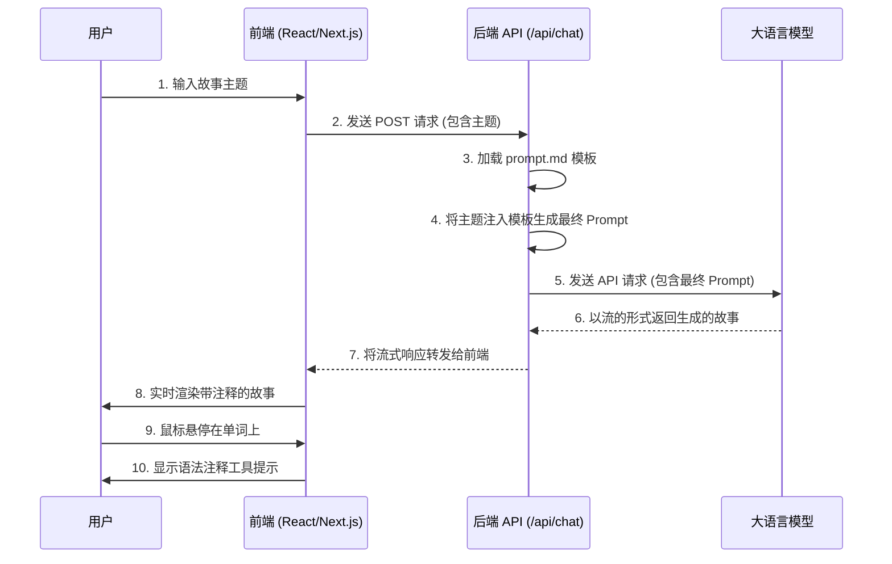

# 项目介绍：AI 语言学习故事生成器

本项目是一个基于 Next.js 的 Web 应用，旨在通过人工智能（AI）生成带有详细语法注释的故事，从而帮助用户（特别是中文母语者）学习外语（目前已支持俄语和英语）。

## 核心功能

1.  **用户认证**: 使用 NextAuth.js 实现安全的用户注册和登录功能。
2.  **对话历史记录**:
    *   用户的每次对话都会被安全地存储在数据库中。
    *   左侧的侧边栏会显示所有历史对话列表，方便用户随时回顾。
    *   用户可以通过点击“新建”按钮或直接访问根 URL 来开始一个新的对话。
3.  **AI 驱动的故事生成**: 用户可以输入一个故事主题，应用会向后端 API 发送请求。
4.  **动态 Prompt 工程**: 后端接收到主题后，会将其注入一个精心设计的、包含复杂规则的 Prompt 模板中。
5.  **与大语言模型 (LLM) 集成**: 后端将最终的 Prompt 发送给一个外部的大语言模型（如阿里云通义千问、Google Gemini 等）。
6.  **流式响应**: LLM 生成的故事内容会以流的形式实时传输回前端，用户可以立即看到生成的过程。
7.  **交互式语法注释**:
    *   AI 模型被指示以特定的 `单词 [注释]` 格式生成文本。
    *   前端利用正则表达式解析这种格式，将带注释的单词渲染为可交互的组件。
    *   当用户将鼠标悬停在这些单词上时，会显示一个包含其词性、原形和中文翻译的工具提示，极大地提升了学习体验。

## 技术栈

*   **框架**: [Next.js](https://nextjs.org/) (使用 App Router 和 Turbopack)
*   **语言**: [TypeScript](https://www.typescriptlang.org/)
*   **样式**: [Tailwind CSS](https://tailwindcss.com/)
*   **数据库 ORM**: [Prisma](https://www.prisma.io/)
*   **数据库**: [SQLite](https://www.sqlite.org/index.html)
*   **认证**: [NextAuth.js](https://next-auth.js.org/)
*   **AI 集成**: 通过 `fetch` API 与任意大语言模型服务进行集成。

## 工作流程



## 关键文件解析

*   `src/app/page.tsx`: 应用主页。处理用户会话，如果用户未登录则显示登录组件 (`Auth.tsx`)，否则显示主聊天界面。
*   `src/components/Chat.tsx`: 核心聊天组件。包含输入框和故事显示区域，负责调用后端 API 并处理流式响应。
*   `src/components/StoryRenderer.tsx`: 解析包含 `单词 [注释]` 格式的文本，并使用 `AnnotatedWord.tsx` 组件来渲染带注释的单词。
*   `src/components/AnnotatedWord.tsx`: 一个UI组件，当鼠标悬停在其上时，会显示一个包含注释的工具提示。
*   `src/app/api/chat/route.ts`: 后端 API 端点。负责与大语言模型进行通信。
*   `src/prompts/prompt.md`: **项目的核心逻辑所在**。这个文件包含了详细的规则，指导 AI 如何为不同语言（俄语、英语）的名词、动词、形容词和副词生成精确格式的注释。
*   `prisma/schema.prisma`: 定义了数据库模型，主要用于 NextAuth.js 的用户认证体系。

## 如何本地运行

1.  **安装依赖**:
    ```bash
    npm install
    ```

2.  **设置环境变量**:
    复制 `.env.example` (如果存在) 为 `.env` 文件，并填入必要的环境变量，例如 `DATABASE_URL` 和 AI 服务的 API Key。
    ```
    DATABASE_URL="file:./dev.db"
    NEXTAUTH_URL="http://localhost:3000"
    NEXTAUTH_SECRET="a_secret_string_for_nextauth"
    ```

3.  **初始化并迁移数据库**:
    Prisma 会根据 `schema.prisma` 文件创建数据库和表。
    ```bash
    npx prisma migrate dev --name init
    ```

4.  **启动开发服务器**:
    ```bash
    npm run dev
    ```

5.  在浏览器中打开 `http://localhost:3000` 即可访问应用。
